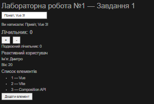
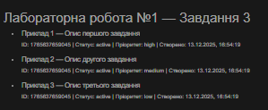
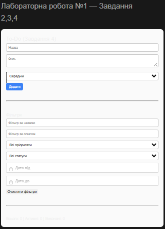

# Лабораторна робота №1 — Vue.js 3 (Composition API)

## Опис роботи
У лабораторній роботі реалізовано знайомство з Vue.js 3 з використанням Composition API.
Проєкт створено за допомогою Vite. Реалізовано реактивність, директиви Vue,
роботу з computed, watch, Vue DevTools та To-Do застосунок із збереженням даних
у LocalStorage.

---

## Запуск проєкту

1. Перейти в директорію проєкту:
```bash
cd vue-project
```
2. Встановити залежності:
npm install

3. Запустити сервер розробки:
npm run dev

4. Відкрити у браузері:
http://localhost:5173

---

# Завдання 1 — Composition API
## У App.vue реалізовано:
- ref — лічильник, текстове поле, масив елементів
- reactive — обʼєкт користувача
- computed — подвоєне значення лічильника
- watch — відстеження змін лічильника

# Використані директиви:
- v-model — інпути
- v-on (@) — обробка подій
- v-for — вивід списків
- v-if / v-show — умовне відображення
- v-bind (:) — атрибути

# Завдання 3 — Модель даних завдання
## Модель To-Do завдання:
- id
- title
- description
- status (active | done)
- createdAt
- priority (low | medium | high)
Модель реалізована у файлі src/models/TodoModel.js.
У App.vue відображено 3 прикладові завдання з цієї моделі.

# Завдання 4 — Логіка та реактивність (To-Do)
## Реалізовано у компоненті TodoList.vue:
додавання задач з мінімальною валідацією

редагування та видалення задач

перемикання статусу active / done

фільтрація за:
- назвою
- описом
- статусом
- пріоритетом
- датою створення (від / до)
- очистка фільтрів
- лічильники через computed: total, active, completed
- зчитування задач з LocalStorage при старті
- збереження задач у LocalStorage через watch з { deep: true }
- використано @vuepic/vue-datepicker

# Vue DevTools
## Через Vue DevTools можна:
- переглянути дерево компонентів
- побачити реактивні дані (todos, фільтри)
- перевірити computed-лічильники
- відстежити оновлення стану та LocalStorage

# Скріншоти:






# Git
- Робота виконувалась у гілці lab1
- Після завершення виконано merge у main
- Коміти оформлені у стилі Conventional Commits
- feat: add composition api examples
- feat: implement todo list
- feat: add localStorage persistence
- docs: add README for lab1


---
