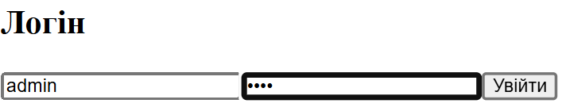
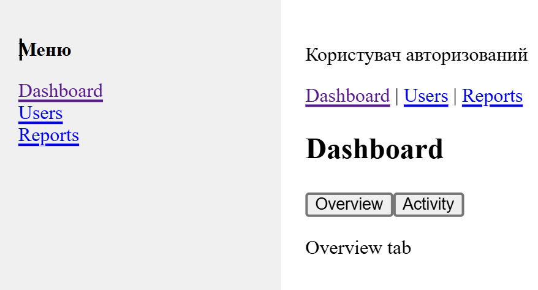
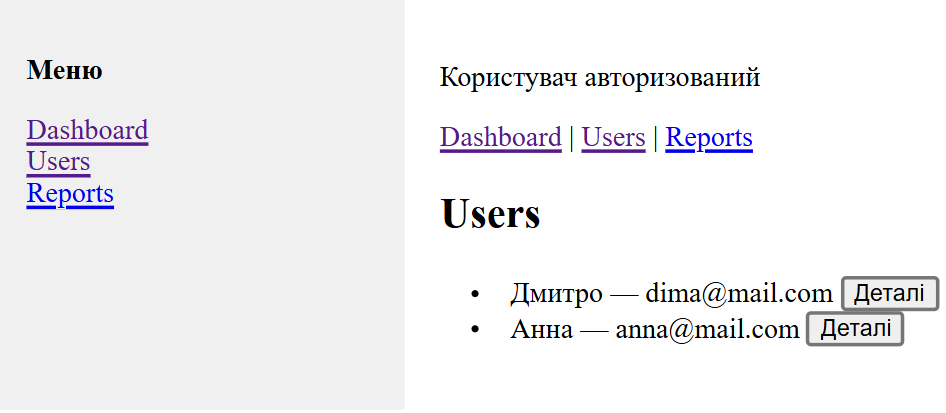
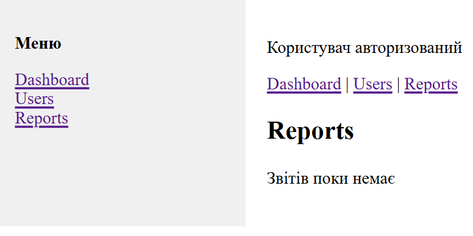

# Лабораторна робота №2  
## Взаємодія між компонентами та роутинг у Vue.js

---

## Мета роботи
Опанувати основні механізми взаємодії між компонентами у Vue.js 3:
- `props` / `emits`
- `v-model` / `defineModel`
- `provide` / `inject`
- слоти (у т.ч. scoped slots)
- хуки життєвого циклу та `KeepAlive`
- Vue Router (lazy-loading, guard’и, вкладені маршрути)

---

## Результат
Реалізовано міні-адмінку з імітованою автентифікацією та роутингом.  
Інтерфейс містить сторінки:
- Login / Register
- Admin (Dashboard / Users / Reports)

Стан підвкладок Dashboard зберігається за допомогою `<KeepAlive>`.

---

## Кроки запуску проєкту

```bash
git clone <repo-url>
cd lab2
npm install
npm run dev
```

## Після запуску застосунок буде доступний за адресою:
http://localhost:5173

---

## Дані для входу (імітація)
- Email: admin
- Password: 1234

# Роутинг (Vue Router)
## Реалізовані маршрути:
- / → redirect на /login
- /login — публічний маршрут
- /register — публічний маршрут
- /admin — захищений маршрут (requiresAuth)
- /admin/dashboard
- /admin/users
- /admin/user/:id
- /admin/reports
- /:pathMatch(.*)* — сторінка NotFound

## Налаштування роутера:
- createWebHistory
- scrollBehavior — прокрутка вгору при зміні маршруту
- linkActiveClass — стилізація активного посилання
- lazy-loading компонентів
- beforeEach guard для перевірки авторизації

---

# Взаємодія між компонентами
## rops / emits
Використані для передачі даних та подій між батьківськими та дочірніми компонентами (наприклад, сторінки Users та UserDetails).

## v-model / defineModel
Застосовано в окремому компоненті інпуту FormInput.vue, який використовується у формах Login та Register.

## provide / inject
Через provide передаються дані про авторизованого користувача, які зчитуються через inject у Sidebar та AdminLayout для умовного відображення UI.

---

# Слоти
## Звичайні слоти:
обгортка для сторінок Login та Register
Sidebar (меню навігації)

## Scoped slot:
сторінка Reports використовує слот #row="{ item }" для кастомного рендеру рядків таблиці

---

# KeepAlive та життєвий цикл
На сторінці Dashboard реалізовано дві підвкладки:
- Overview
- Activity
Компоненти загорнуті у <KeepAlive> з використанням параметрів include та max.
Для демонстрації роботи застосовані хуки onActivated та onDeactivated.

---

# Скріншоти








---

# Git та коміти
- Робота виконувалась у гілці lab2
- Після завершення виконано merge у гілку main
- Коміти оформлені у стилі Conventional Commits, приклади:
- feat: add router with auth guards
- feat: implement login and register pages
- feat: add keep-alive dashboard tabs
- feat: add scoped slots for reports

---

# Висновок
У ході лабораторної роботи реалізовано SPA-застосунок на Vue.js 3 з повноцінною маршрутизацією, взаємодією між компонентами, кешуванням стану через KeepAlive та імітованою автентифікацією. Усі вимоги лабораторної роботи №2 виконані.
