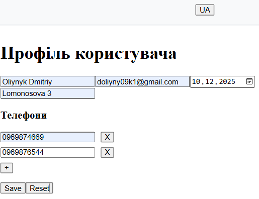

# Лабораторна робота 4: Pinia, i18n, VeeValidate

Демонстрація роботи з менеджером стану **Pinia** (включно з персистентністю), локалізацією **vue-i18n** та валідацією форм (динамічних) через **VeeValidate**.

## Інструкція запуску

1. **Встановлення залежностей**:
   ```bash
   npm install
   ```
2. **Запуск сервера розробки**:
   ```bash
   npm run dev
   ```
3. Відкрийте посилання у браузері (зазвичай `http://localhost:5173`).

## Використані технології та стори

### 1. Pinia (State Management)
Використовується для централізованого зберігання даних.
*   **Стори (`src/stores/`)**:
    *   `products.js`: Список товарів (readonly data). Використовує `defineStore` та початковий `state`.
    *   `cart.js`: Кошик покупок. Має `getters` (`totalCount`, `totalPrice`) та `actions` (`add`, `remove`, `clear`).
    *   `settings.js`: Налаштування мови.
*   **Persisted State**:
    *   У сторі `settings.js` налаштовано збереження в `localStorage` за допомогою плагіна `pinia-plugin-persistedstate`.
    *   Параметри: `persist: { key: 'settings-store', pick: ['locale'] }` — зберігається лише поле `locale` під ключем `settings-store`.
*   **Використання в компонентах**:
    *   `storeToRefs`: Використовується в `CartPage.vue` для реактивного деструктурування (`const { items } = storeToRefs(cart)`), щоб не втратити реактивність.

### 2. Vue I18n (Localization)
Забезпечує багатомовність інтерфейсу (UA/EN).
*   **Налаштування (`src/i18n.js`)**:
    *   Створено через `createI18n`.
    *   Визначено повідомлення (`messages`) для `en` та `ua`.
    *   **Custom Modifiers**: Додано модифікатори, наприклад `upper` (верхній регістр) або `shout` (додавання "!!!"), які можна використовувати в шаблоні як `{{ t('key.path') }}` (хоча в поточному коді використовуються стандартні виводи).
*   **Синхронізація**:
    *   У компоненті `LanguageSwitcher` при зміні мови оновлюється як `i18n.global.locale`, так і `settingsStore.locale` (для збереження після перезавантаження).

### 3. VeeValidate (Form Validation)
Використовується для валідації форми профілю (`ProfilePage.vue`).
*   **Schema**: Валідація описується схемою **Yup** (`yup.object({...})`).
*   **useForm**: Ініціалізація форми зі схемою та початковими значеннями.
*   **useFieldArray**: Використовується для динамічного масиву телефонів (`phones`). Дозволяє додавати (`push`) та видаляти (`remove`) поля "на льоту".
*   **setFieldError / Errors**: Помилки відображаються автоматично або через перевірку стану поля. Повідомлення про помилки також локалізовані (`t("errors.required")`).

## Скріншоти

### Профіль

