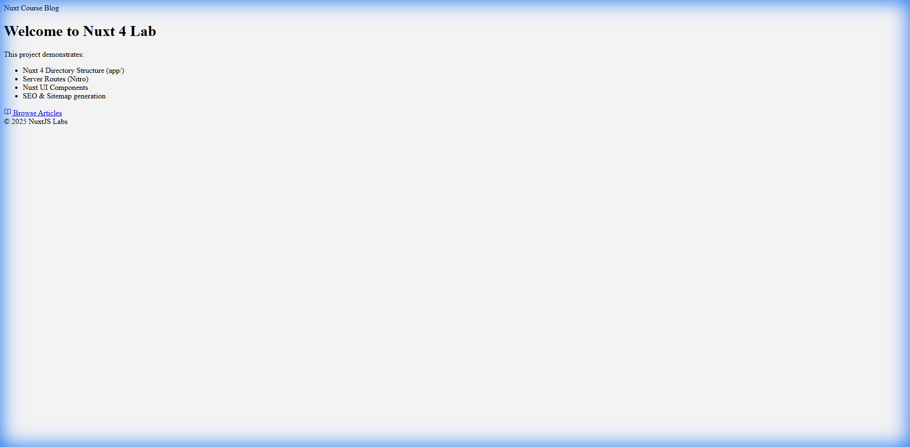
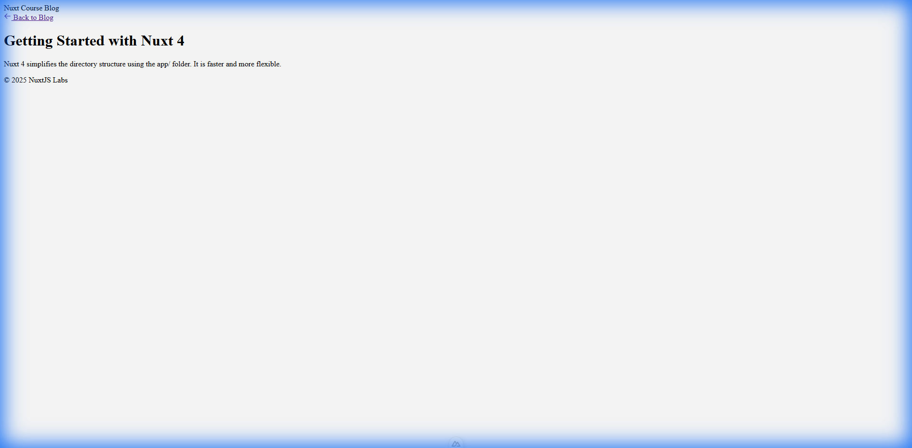
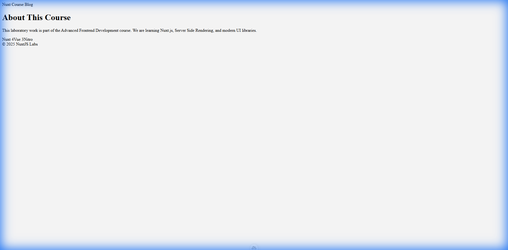
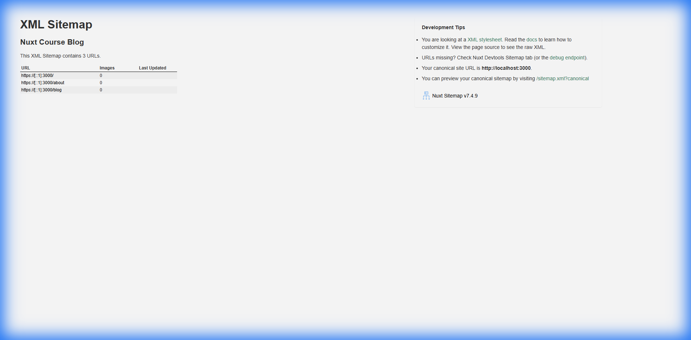

# Лабораторна робота 6: Nuxt.js 4 та Nuxt UI

Цей проєкт демонструє використання новітніх можливостей **Nuxt 4**, включаючи оновлену структуру директорій (`app/`), серверні роути (Nitro), Nuxt UI компоненти, а також налаштування SEO.

## Інструкція запуску

1. **Встановлення залежностей**:
   ```bash
   npm install
   ```

2. **Запуск сервера розробки**:
   ```bash
   npm run dev
   ```

3. **Відкрити в браузері**: `http://localhost:3000`

## Структура та реалізація

### 1. Nuxt 4 Directory Structure
Використано нову структуру папок, рекомендовану для Nuxt 4.
*   Усі файли додатку знаходяться в директорії `app/` (замість кореня).
*   Конфігурація у `nuxt.config.ts` включає: `future: { compatibilityVersion: 4 }`.

### 2. Server Routes (Nitro) & useFetch
API реалізовано за допомогою Nitro у директорії `server/api/`.
*   **API Endpoints**:
    *   `server/api/posts.get.ts`: Повертає список всіх статей.
    *   `server/api/posts/[slug].get.ts`: Повертає статтю за динамічним параметром `slug` (використовує `defineEventHandler`, `getRouterParam`).
*   **Fetching Data**:
    *   У `app/pages/blog/index.vue`:
        ```ts
        const { data: posts, status } = await useFetch('/api/posts')
        ```
    *   У `app/pages/blog/[slug].vue`:
        ```ts
        const { data: post, error } = await useFetch(() => `/api/posts/${route.params.slug}`)
        ```
        Зверніть увагу на використання стрілочної функції в `useFetch` для реактивності URL.

### 3. SEO Optimization
Для покращення SEO використано вбудовані composables та модулі.
*   **Meta Tags**:
    *   Використано `useSeoMeta` на кожній сторінці (`index.vue`, `about.vue` тощо) для встановлення `title`, `description`, `ogTitle`.
    *   Приклад (`index.vue`): `useSeoMeta({ title: 'Home...', description: '...' })`.
*   **Modules**:
    *   `@nuxtjs/sitemap`: Автоматично генерує `sitemap.xml` (доступний за адресою `/sitemap.xml`).
    *   `@nuxtjs/robots`: Генерує `robots.txt` для керування індексацією.

### 4. Nuxt UI Components
Інтерфейс побудовано з використанням бібліотеки `@nuxt/ui`.
Основні використані компоненти:
*   `UContainer`, `UCard`: Для структури та карток статей (сторінки `index.vue`, `blog/index.vue`).
*   `UButton`: Для кнопок навігації ("Read more", "Back to Blog").
*   `UBadge`: Для тегів на сторінці `about.vue`.
*   `UHorizontalNavigation`: У `layouts/default.vue` для головного меню.
*   `UAlert`: Для відображення помилок (404 Not Found) на сторінці статті.
*   `USkeleton`: Для стану завантаження (`status === 'pending'`).

## Скріншоти

### Головна сторінка (Home)


### Блог (Blog List)

*Список статей, завантажений через useFetch('/api/posts').*

### Сторінка статті (Dynamic Route)

*Детальна сторінка, завантажена через useFetch динамічний роут.*

### Сторінка "Про нас" (About)


### Sitemap (SEO)

*Автоматично згенерований sitemap.xml.*
